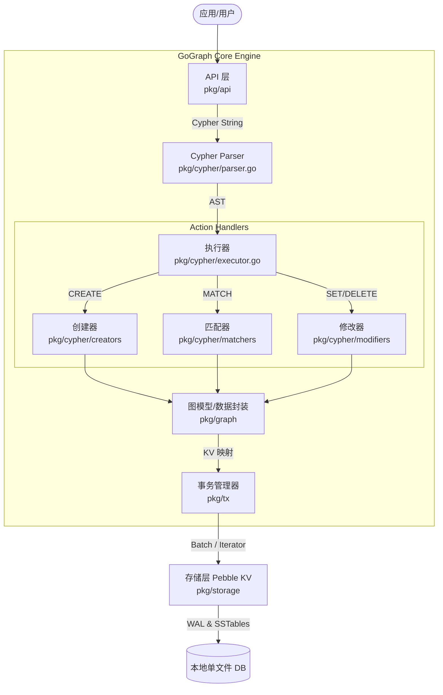

# 系统架构 (Architecture)

GoGraph 是一个纯 Go 编写的单文件嵌入式图数据库，专为了满足极简、零依赖的高效运行场景。系统设计通过清晰的分层模型解耦，确保模块之间职责单一且高内聚。

## 1. 系统模块划分

GoGraph 的核心架构分为 5 层：

1. **API 层 (`pkg/api`)**：提供面向用户的友好接口，类似于 `database/sql` 的 `Open`, `Query`, `Exec` 等。
2. **Cypher 解析与执行层 (`pkg/cypher`)**：
   - **Parser**: 词法分析与语法解析，将 Cypher 语句解析为抽象语法树 (AST)。
   - **AST**: 声明执行节点、结构、和数据块。
   - **Executor**: 协调 Matcher、Creator 和 Modifier 执行特定的语句意图。
3. **图模型层 (`pkg/graph`)**：包含点 (`Node`)、边 (`Relationship`)、属性类型 (`PropertyValue`) 的数据结构封装，并处理与之相关的核心逻辑（如邻接表管理 `AdjacencyList` 和索引 `Index`）。
4. **事务层 (`pkg/tx`)**：封装 Pebble DB 提供事务机制，控制多版本并发（MVCC），处理安全读写。
5. **存储层 (`pkg/storage`)**：基于 CockroachDB 的 Pebble，作为单文件存储引擎，并负责 `encoding/gob` 的序列化编解码工作。

## 2. 系统架构图

以下 Mermaid 图表展示了 GoGraph 的架构和数据流：

## 3. 数据流向说明 (以 CREATE 为例)

1. 用户调用 `api.Exec("CREATE (n:User {name: 'Alice'})")`。
2. `api.DB` 调用 `cypher.Parser` 将语句解析为 `AST`（带有 `CreateClause`）。
3. `Executor` 获取到一个事务对象 `Tx`，并将其交给 `Creator` 引擎。
4. `Creator` 解析 `AST` 生成对应的 `graph.Node` 对象，赋予全局唯一的自增 `ID`。
5. `graph` 层使用 `storage.Marshal` 将其序列化成二进制 (`gob`)。
6. `Creator` 委托领域层的 `graph.Index` 和 `graph.AdjacencyList`（将事务 `Tx` 隐式转换为 `graph.Mutator` 传入），同步构建标签索引、属性索引和邻接表 KV 键。
7. 最终，`Storage` 通过 Pebble 的 `Commit` 写出到磁盘，变更对其他查询可见。

## 4. 核心执行引擎优化 (Query Optimization)

重构后的 GoGraph 实现了更先进的底层查询执行路径：
- **Index Scan (索引扫描)**：当 `MATCH` 语句指定了节点的 Label 时（如 `MATCH (n:User)`），引擎不再执行 $O(N)$ 的全表扫描，而是通过 `Index` 树直接以 $O(K)$ 复杂度命中匹配的 Node ID。
- **Graph Traversal (图遍历)**：对于包含关系的查询（如 `MATCH (n)-[r]->(m)`），系统充分利用邻接表 `AdjacencyList`，从起始节点 $O(1)$ 获取所有关联边的 ID 并精准加载，彻底消灭了边关系的全表暴力遍历。
- **充血模型**：所有底层的 KV 拼装逻辑收拢在 `pkg/graph` 层，`Cypher` 执行器仅负责调度，保证了事务修改的原子性与代码高内聚。

## 5. 核心技术栈说明

- **基础语言**：Go 1.18+（广泛兼容跨平台）
- **持久化底层**：`github.com/cockroachdb/pebble`（替代 LevelDB，高性能 KV 库）
- **对象序列化**：Go 原生 `encoding/gob`（零外部依赖，极快且原生的编解码方案）
- **可观测性**：基于 Option 模式进行注入的 Logger/Tracer 设计（在 `pkg/cypher/observability.go` 中定义）。
